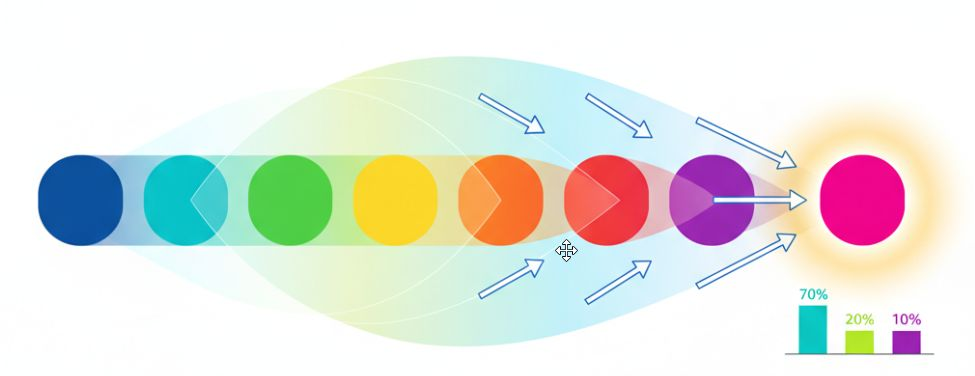
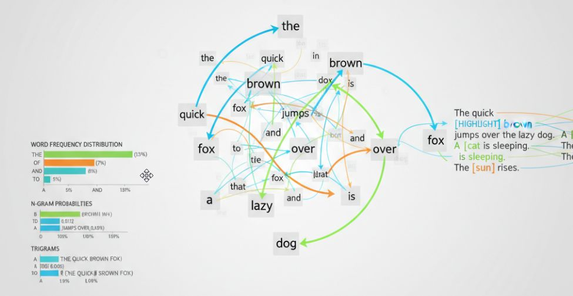
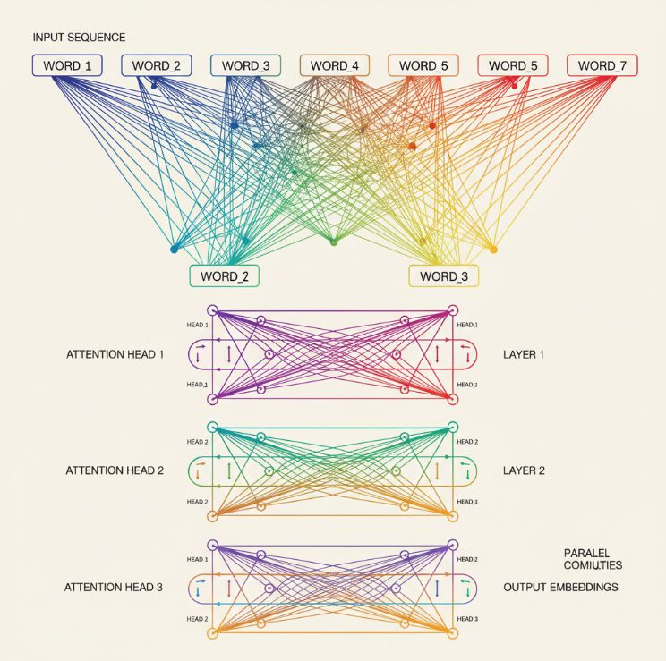
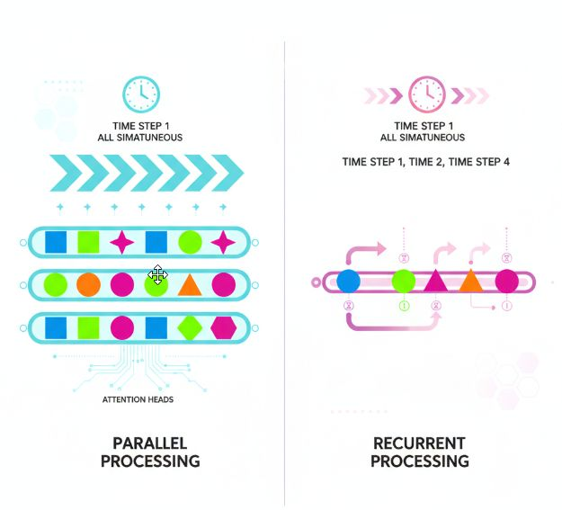
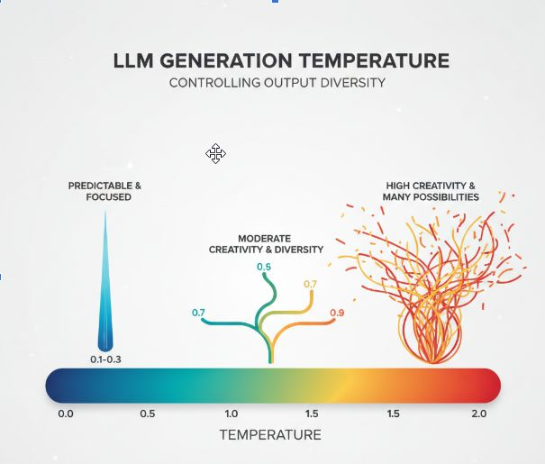
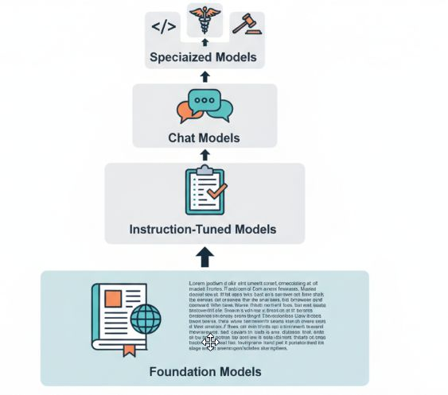

Это обзорная статья цикла «Базовый минимум» — по тезисам:

- большие языковые модели;
- архитектура;
- техники использования;
- тренды.

**Видео версия (~9 мин):** [Смотреть на YouTube](https://youtu.be/xHLP2f2WVpU)

## Большие языковые модели (LLM)

### Что это? - Это инструмент, далее возможности и применение {.toc-heading-only}

Что это? - Это инструмент, далее возможности и применение

<strong>Генерация текста</strong>

<ul>
<li>Создание статей, историй, маркетинговых материалов</li>
<li>Автоматическое составление отчётов и документации</li>
<li>Творческое письмо и контент различных жанров</li>
</ul>

<strong>Ответы на вопросы</strong>

<ul>
<li>Интеллектуальные чат-боты для поддержки клиентов</li>
<li>Системы вопросов-ответов для поиска информации</li>
<li>Виртуальные ассистенты для повседневных задач</li>
</ul>

<strong>Анализ и обработка языка</strong>

<ul>
<li>Классификация текстов по категориям и тональности</li>
<li>Суммаризация длинных документов</li>
<li>Перевод между языками с сохранением контекста</li>
</ul>

<strong>Программирование и код</strong>

<ul>
<li>Генерация кода по текстовому описанию</li>
<li>Отладка и исправление ошибок</li>
<li>Комментирование и объяснение сложных участков кода</li>
</ul>

*Инструмент мощный — но важно понимать, как он устроен и где ломается.*

### Что это технически? - Огромная статистическая машина {.toc-heading-only}

Что это технически? - Огромная статистическая машина

<strong>Определение и принципы работы</strong>

Нейросетевые модели, обученные предсказывать следующий токен на основе контекста.

Используют статистические закономерности в языке для генерации текста.

LLM использует полный контекст для определения наиболее вероятного следующего слова.

<strong>Флоу предсказания токенов LLM</strong>

<strong>Входной контекст:</strong> «Карл у Клары украл…»

<strong>Анализ контекста:</strong>

<ul>
<li>Карл (субъект)</li>
<li>у Клары (у кого)</li>
<li>украл (действие)</li>
</ul>

<strong>Предсказание:</strong> Модель анализирует все предыдущие токены и их связи, распознаёт паттерн известной скороговорки

→ «кораллы»

<strong>Вероятность:</strong> 85%

<strong>Трансформеры и архитектура</strong>

Механизм self-attention для обработки последовательностей (ну тут всё понятно — на самом деле нет).

Параллельная обработка данных вместо рекуррентной.

Многослойная структура с миллиардами параметров (тепловая карта весов).

<strong>Обучение на текстовых данных</strong>

<ul>
<li>Обучение без учителя на миллиардах текстовых примеров</li>
<li>Предобучение на общих данных с последующей специализацией</li>
<li>Масштабирование данных и вычислительных ресурсов</li>
</ul>

### Как использовать? - обзор техник работы с LLM {.toc-heading-only}

Как использовать? - обзор техник работы с LLM

<strong>Промпт-инжиниринг</strong>

<ul>
<li>Искусство формулирования запросов для лучших результатов</li>
<li>Структурирование инструкций с ролями, примерами и контекстом</li>
<li>Итеративное улучшение запросов для точных ответов</li>
</ul>

Развёрнуто по техникам (zero-shot, few-shot, CoT, роли, step-back и др.): <a class="link" href="/p/ai-basics-prompt-engineering/">Базовый минимум про ИИ – промпт-инжиниринг</a>.

<strong>Fine-tuning (дообучение)</strong>

<ul>
<li>Адаптация модели под специфические задачи и домены</li>
<li>Использование небольших наборов размеченных данных</li>
<li>RLHF (обучение с подкреплением по обратной связи человека)</li>
</ul>

<strong>RAG (Retrieval-Augmented Generation)</strong>

<ul>
<li>Расширение знаний модели через поиск в базе данных</li>
<li>Комбинирование внешних источников информации с генерацией</li>
<li>Уменьшение галлюцинаций через опору на проверенные факты</li>
</ul>

Подробнее про этапы, чанкование и типы пайплайнов: <a class="link" href="/p/ai-basics-rag/">Базовый минимум про ИИ – RAG-системы</a>.

<strong>Chain-of-thought</strong>

<ul>
<li>Пошаговое рассуждение для решения сложных задач</li>
<li>Промежуточные вычисления и логические переходы</li>
<li>Улучшение математических и логических способностей модели</li>
</ul>

### Популярные модели {.toc-heading-only}

Популярные модели

<strong>GPT (OpenAI)</strong>

<ul>
<li>Серия моделей от GPT-3 до GPT-5.4, лидеры индустрии</li>
<li>Коммерческие API с широким спектром возможностей</li>
<li>ChatGPT как массовый продукт на базе этих моделей</li>
</ul>

<strong>Claude (Anthropic)</strong>

<ul>
<li>Фокус на безопасность и длинный контекст</li>
<li>Конституционный подход к выравниванию с человеческими ценностями</li>
<li>Способность обрабатывать большие объёмы текста (до 1М токенов)</li>
</ul>

<strong>LLaMA</strong>

<ul>
<li>Открытая модель от Meta для исследовательского сообщества</li>
<li>Основа для множества производных моделей (Alpaca, Vicuna)</li>
<li>Компактные версии для локального запуска</li>
</ul>

<strong>Отечественные разработки</strong>

<ul>
<li>YandexGPT с поддержкой русского языка</li>
<li>GigaChat от Сбера для бизнес-применений</li>
<li>Модели Vikhr и другие разработки для специализированных задач</li>
</ul>

### Ключевые понятия {.toc-heading-only}

Ключевые понятия

<strong>Токен</strong>

<ul>
<li>Минимальная единица текста для обработки моделью</li>
<li>Может быть словом, частью слова или символом</li>
<li>Примеры: «привет» = 1 токен, «непредсказуемость» = 2–3 токена</li>
<li>Токенизация разбивает текст на последовательность токенов</li>
</ul>

<strong>Температура</strong>

<ul>
<li>Низкая температура (0.1–0.3): предсказуемый, точный текст</li>
<li>Средняя температура (0.7–0.9): баланс креативности и связности</li>
<li>Высокая температура (1.5–2.0): творческий, но менее связный текст

</li>
</ul>

<strong>Типы моделей по назначению</strong>

<ul>
<li>Базовые (foundation): предобученные на больших корпусах текста</li>
<li>Инструктивные (instruction-tuned): обучены следовать инструкциям пользователя</li>
<li>Чат-модели: оптимизированы для диалогов и многошаговых разговоров</li>
<li>Специализированные: настроенные под конкретные задачи (код, медицина, юриспруденция)

</li>
</ul>

<strong>Контекстное окно</strong>

<ul>
<li>Ограничение на объём текста, который модель обрабатывает за раз</li>
<li>Различные техники расширения контекста (8K–100K токенов)</li>
<li>Потеря информации при работе с длинными документами</li>
</ul>

### Проблемы и ограничения {.toc-heading-only}

Проблемы и ограничения

<strong>Галлюцинации</strong>

<ul>
<li>Модель может выдумывать несуществующие факты с уверенным видом</li>
<li>Создание правдоподобной, но ложной информации</li>
<li>Сложность верификации сгенерированного контента</li>
</ul>

<strong>Вычислительные ресурсы</strong>

<ul>
<li>Требуются мощные GPU/TPU для обучения и инференса</li>
<li>Высокие энергозатраты на обучение крупных моделей</li>
<li>Стоимость разработки и поддержки инфраструктуры</li>
</ul>

<strong>Этические вопросы</strong>

<ul>
<li>Предвзятость и стереотипы в обучающих данных</li>
<li>Проблемы безопасности и генерации вредоносного контента</li>
<li>Нарушение авторских прав и вопросы интеллектуальной собственности</li>
</ul>

### Будущее и тренды {.toc-heading-only}

Будущее и тренды

<strong>Мультимодальность</strong>

<ul>
<li>Работа с текстом, изображениями, аудио и видео</li>
<li>Понимание и генерация контента в различных форматах</li>
<li>Интеграция разных модальностей для комплексного понимания</li>
</ul>

<strong>Агенты на базе LLM</strong>

<ul>
<li>Автономные системы для выполнения сложных задач</li>
<li>Планирование действий и принятие решений</li>
<li>Взаимодействие с внешними инструментами и API</li>
</ul>

<strong>Оптимизация моделей</strong>

<ul>
<li>Квантизация и дистилляция для ускорения работы</li>
<li>Разработка более эффективных архитектур</li>
<li>Баланс между размером модели и её возможностями</li>
</ul>

<strong>Локальные решения</strong>

<ul>
<li>Модели, работающие на персональных устройствах</li>
<li>Конфиденциальность данных без отправки в облако</li>
<li>Специализированное аппаратное обеспечение для LLM</li>
</ul>

